# Cutting Edge — the interface at 0.4.1

Every image below was captured from the **running application** at 1440×900 — no mock-ups.

---

## 0.4.1 — no bars at all

The Electron menu, the tab strip, the heading band, the properties panel and the save
bar are gone. The wordmark is centred on the launcher, docks into the top-left corner of
a section, and is the way home.

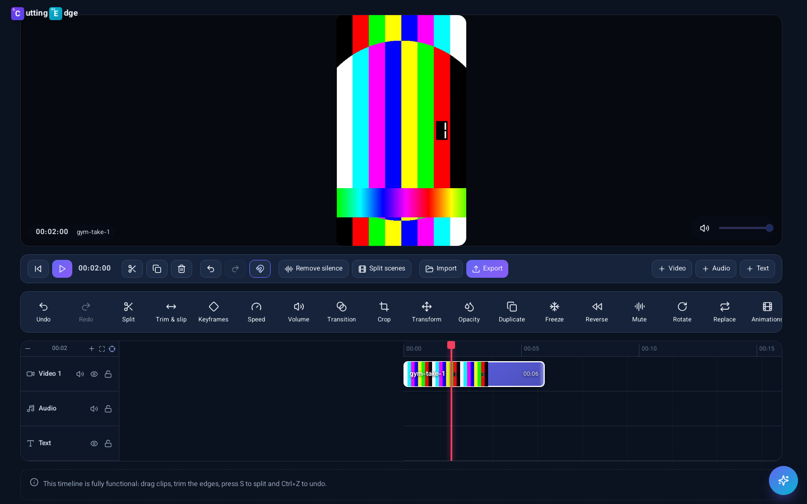

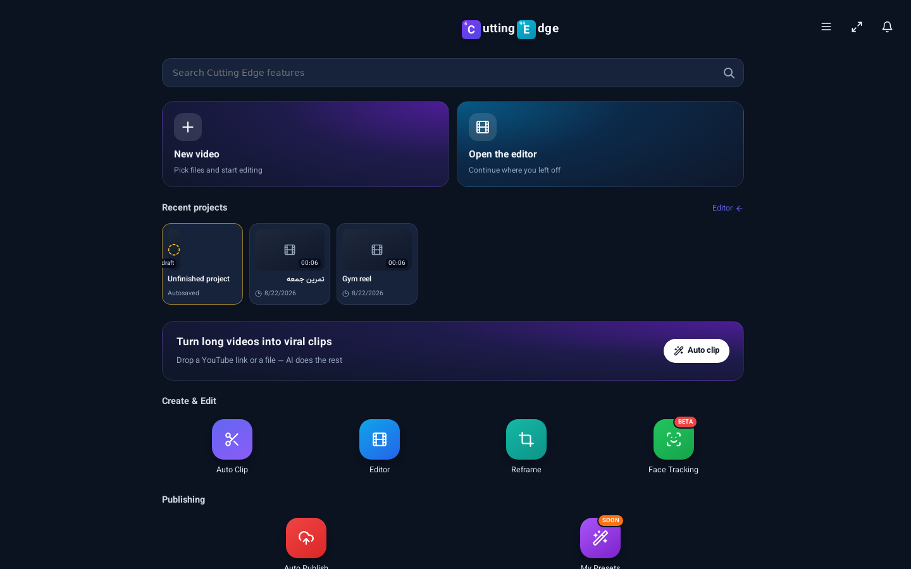

---

## Waveforms and the beat grid

The audio lane draws the shape of the sound, and "Find the beat" puts the tempo grid on
the ruler so cuts can land on the music. Detected here: 120 BPM from a click track.

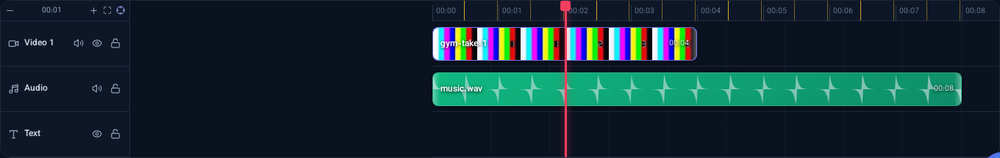

---

## Home — the launcher

The only screen that keeps the brand line and the tab bar: search, two starting cards,
recent projects, and the tiles you begin a session with.

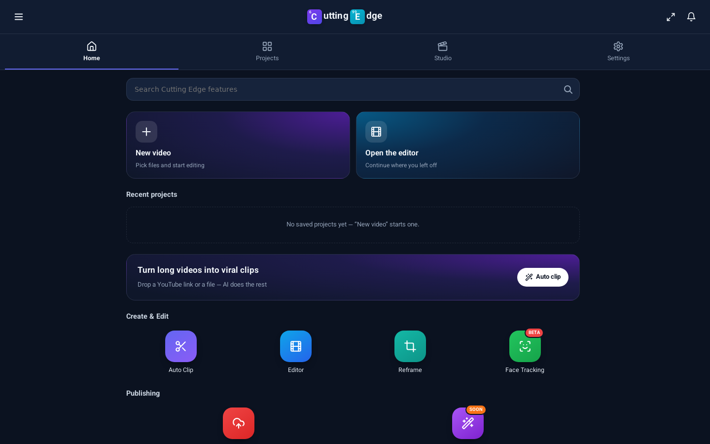

---

## The editor, full screen

Inside a section the chrome fades away and the whole window belongs to the work.
Clips are real film strips, the red playhead is pinned to the centre while the timeline
scrolls under it, and each lane has a separate speaker (sound) and eye (picture).

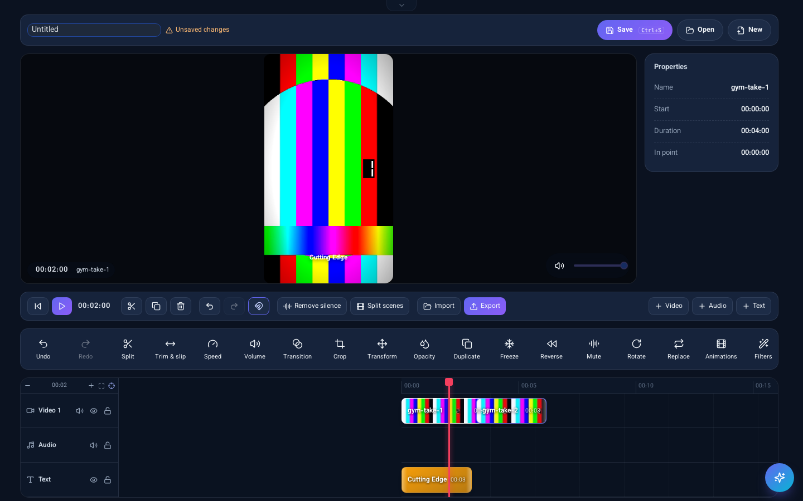

---

## Transitions

Twenty-eight FFmpeg `xfade` transitions, opened from the diamond between two clips.

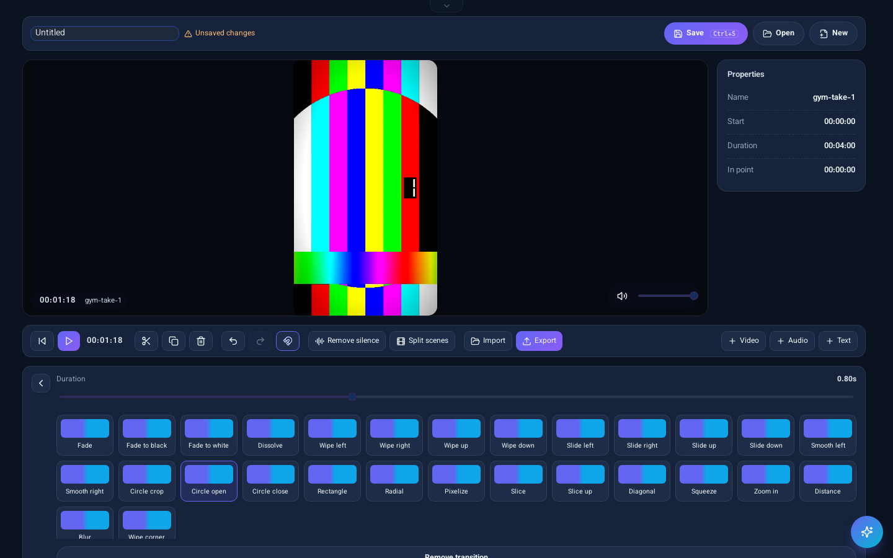

A transition rendered live in the monitor — both clips on screen, the second revealed
through a circle, with the name badged as a preview because the export is the exact one.

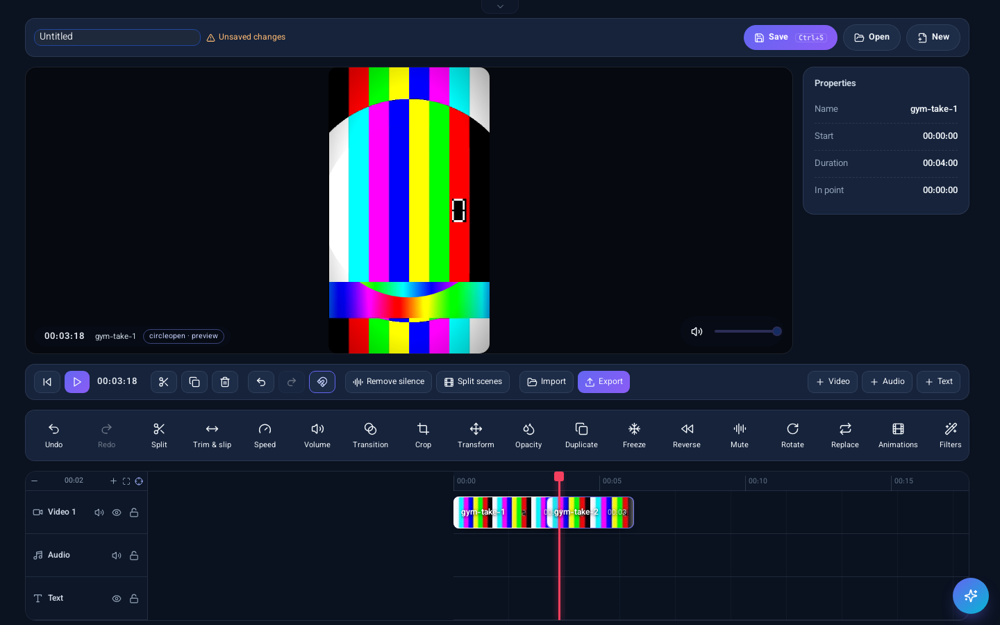

---

## Professional trimming

Ripple, roll, slip and ripple-delete in one panel.

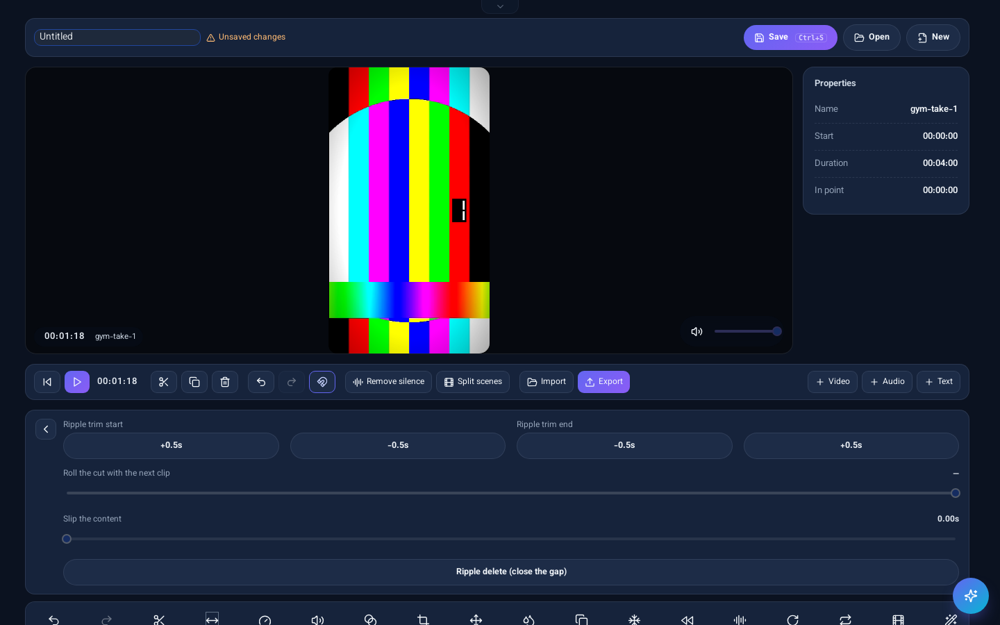

---

## Bringing the menu back

The pointer at the top edge, `Escape`, or the small pill: the header returns with a fade.

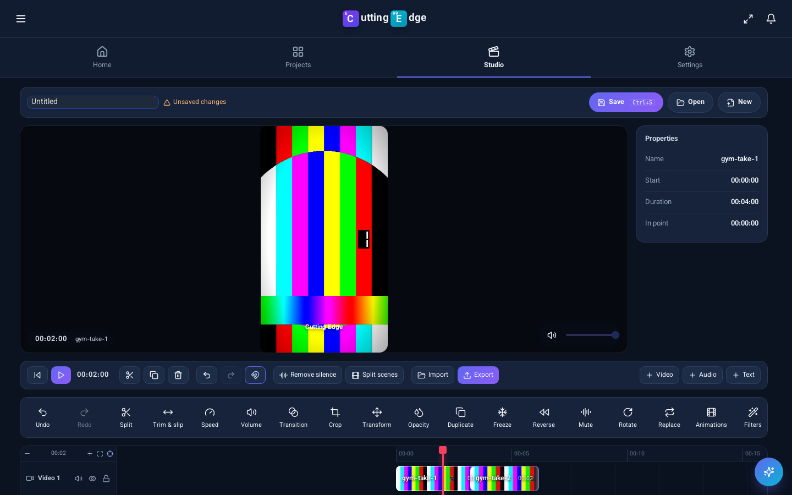

---

## Keyframes

Position, scale, rotation and volume animate over time. Keys are placed at the playhead,
shown as diamonds on the clip, and interpolate linearly — the same rule the FFmpeg
expressions in the compositor use, so the monitor and the exported file agree.

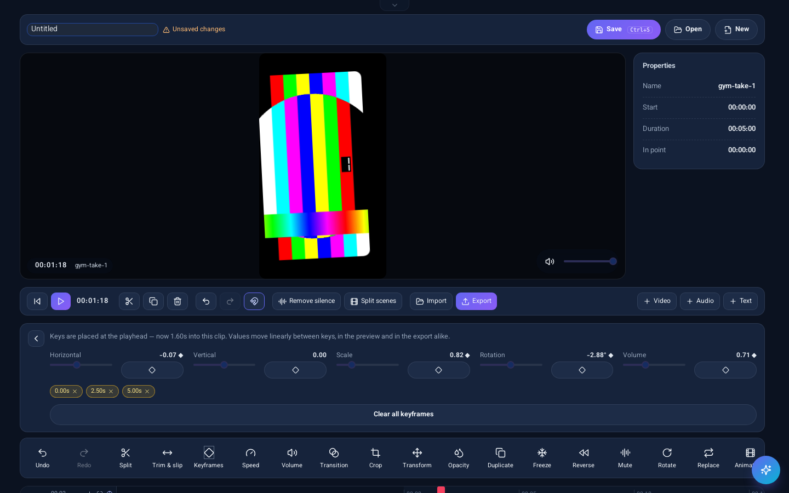

---

## Looks and colour

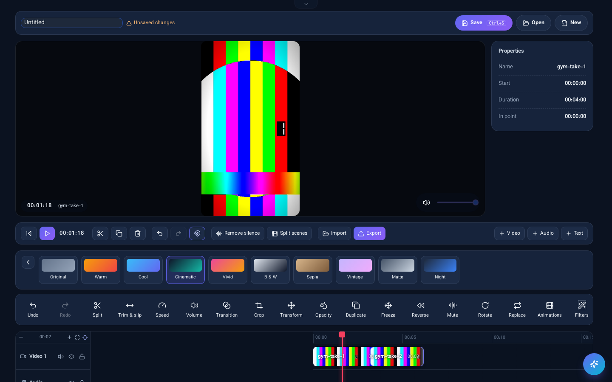

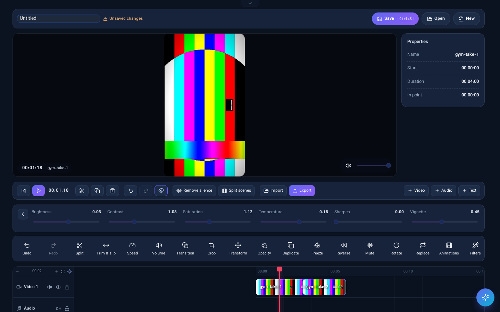
