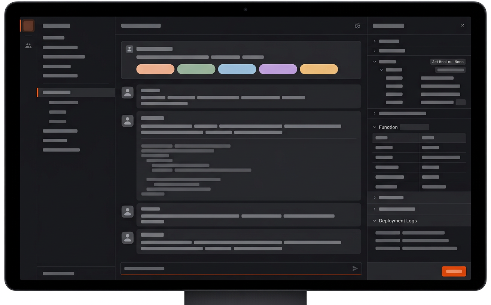
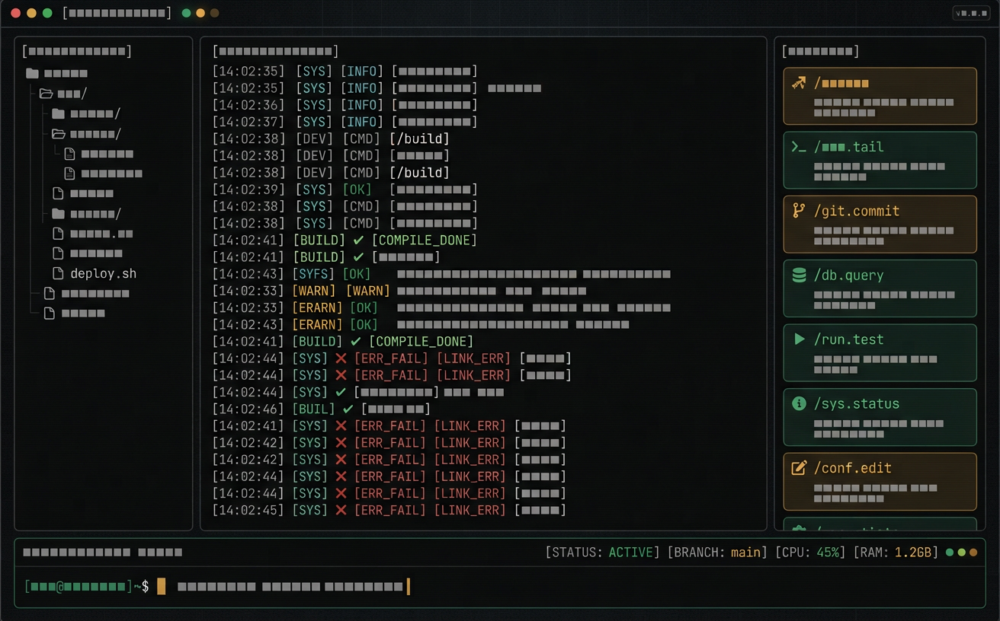
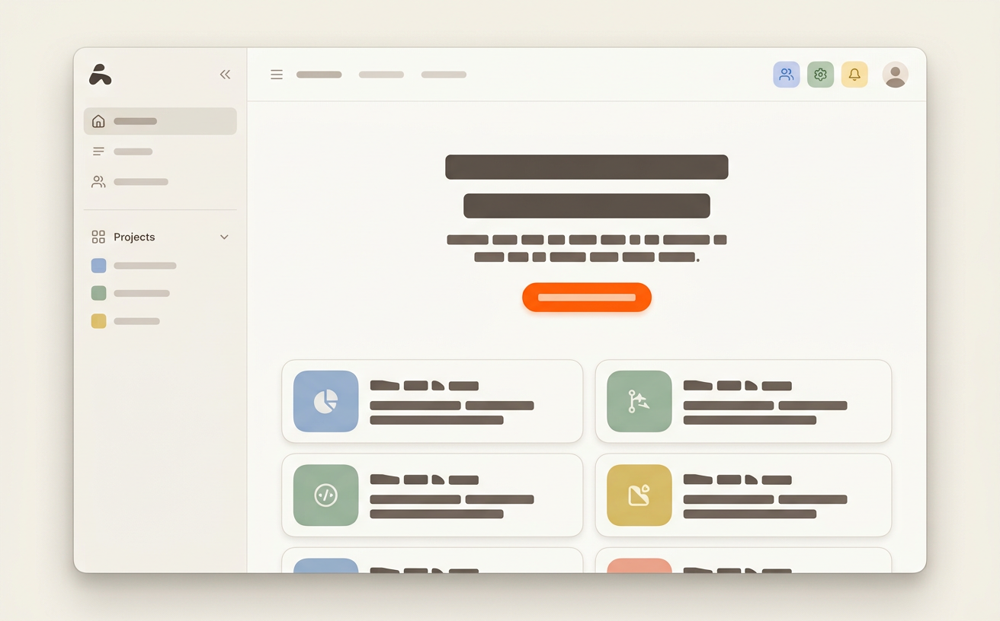
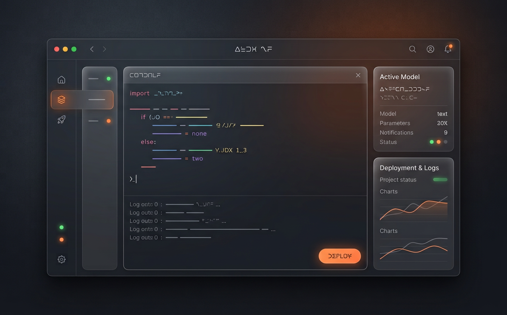

# چهار جهتِ طراحی برای Forge

> برای هر گزینه: تصویر + ساختار + زبانِ بصری + **جزئیاتِ کاملِ انیمیشن**.
> هر چهار گزینه همان محتوا را دارند (سه ستون، چت، مراحلِ عامل، پنلِ کناری)؛
> تفاوت در «شخصیت» است، نه در قابلیت.
>
> انتخاب کنید — بعد همان را با جزئیات پیاده می‌کنم.

---

## الف) سکوتِ ویرایشگر *(Editor Quiet)*

**شخصیت:** ابزارِ حرفه‌ای که حرف نمی‌زند؛ داده حرف می‌زند. ادامه‌ی مسیرِ فعلی، اما با نظمِ واقعی.
**مرجع:** Cursor / Zed.

| ویژگی | مقدار |
|---|---|
| زمینه | نزدیک‌مشکیِ یکدست، بدون گرادیان |
| سطوح | فقط با خطِ موییِ ۱px جدا می‌شوند — **هیچ سایه‌ای** |
| رنگِ تأکید | یک نارنجیِ واحد، فقط برای: دکمهٔ اصلی، نشستِ فعال، زیرخطِ فوکوس |
| شعاع | ۶px برای المان‌های کوچک، ۸px برای ورودی و دکمه |
| تایپ | Inter برای متن، JetBrains Mono برای برچسب و کد |
| تراکم | بالا اما آرام |

**انیمیشن (دقیق):**

| رویداد | مدت | easing | توضیح |
|---|---|---|---|
| ورودِ پیام | ۲۴۰ms | `cubic-bezier(.16,1,.3,1)` | محو + بالا آمدنِ ۸px |
| چیدمانِ پیام‌ها (stagger) | ۲۴ms تأخیرِ پشت‌سرهم | همان | حداکثر ۶ مورد، بعد بدون تأخیر |
| نقطه‌های جریان | ۱۲۰۰ms تکرار | `cubic-bezier(.4,0,.6,1)` | سه نقطه با ۱۶۰ms اختلافِ فاز |
| نشانگرِ تبِ پنل | ۲۴۰ms | همانِ ورود | جابه‌جاییِ عرض با `layout` |
| باز شدنِ پنلِ راهنما | ۳۲۰ms | همان | محوِ زمینه + بالا آمدنِ ۱۲px + مقیاس ۰٫۹۸۵→۱ |
| تغییرِ رنگ در hover | ۱۸۰ms | `ease-out` | فقط رنگ، هیچ جابه‌جایی |
| فشردنِ دکمه | ۱۲۰ms | `ease-out` | مقیاس ۰٫۹۷ |
| تعویضِ تم | ۲۴۰ms | `ease-in-out` | محوِ متقاطعِ متغیرها |

**قانون:** هیچ انیمیشنِ تزئینی — هر حرکت یا «ورود» است یا «تأییدِ عمل».

---

## ب) کنسولِ فرمان *(Command Console)*

**شخصیت:** فرمان‌محور و متراکم؛ رابط شبیهِ یک ترمینالِ مدرن است، نه یک چت.
**مرجع:** Warp / Linear.

| ویژگی | مقدار |
|---|---|
| زمینه | ذغالیِ تیره با شبکه‌ی بسیارِ ملایم |
| تایپ | **مونو در همه جا**، حتی عنوان‌ها و دکمه‌ها |
| لبه‌ها | تیز، شعاعِ ۴px |
| رنگِ تأکید | کهربایی و سبزِ ترمینال؛ قرمز فقط برای خطا |
| تراکم | بسیار بالا؛ ارتفاعِ ردیف کوتاه |
| نشانه‌ها | LEDهای کوچک برای وضعیت |

**انیمیشن (دقیق):**

| رویداد | مدت | easing | توضیح |
|---|---|---|---|
| چشمکِ نشانگرِ ورودی | ۱۰۰۰ms | `steps(2)` | کلاسیکِ ترمینال |
| ظاهر شدنِ خروجی | ۴۰ms تأخیرِ هر خط | — | خروجی خط‌به‌خط می‌آید، مثلِ لاگ |
| ورودِ پیام | ۱۶۰ms | `cubic-bezier(.2,.8,.2,1)` | فقط محو — **بدون مقیاس** (مقیاس اینجا «غیرترمینالی» است) |
| چیپِ فرمان | ۱۸۰ms | همان | لغزشِ ۸px از راست |
| فوکوس | ۱۲۰ms | `ease-out` | حاشیه‌ی ۱px تأکیدی + یک فلشِ بسیار کوتاهِ پس‌زمینه |
| فشردن | ۱۰۰ms | — | تغییرِ رنگ، بدون مقیاس |

**قانون:** سرعت بالا، هیچ حرکتِ «ارتجاعی». این رابط باید حس کند فوری است.

---

## ج) کارگاه *(Studio)*

**شخصیت:** گرم، خوانا، با فضایِ نفس‌کشیدن؛ مناسب برای کسی که می‌خواهد «شروع کند» نه اینکه «ابزار را اداره کند».
**مرجع:** Notion / Arc / Height.

| ویژگی | مقدار |
|---|---|
| زمینه | روشن، سفیدِ گرم (کاغذی) |
| کارت‌ها | سطوحِ کرمِ ملایم با شعاعِ ۱۶px |
| تایپ | عنوان‌های بزرگ و مطمئن (نمایشیِ ۳۶/۲۶) |
| فضا | بخش‌ها با فاصله‌ی ۴۸–۸۰px جدا می‌شوند |
| رنگ | پالتِ پاستیلِ کامل + یک دکمه‌ی نارنجیِ پررنگ |
| تراکم | کم |

**انیمیشن (دقیق):**

| رویداد | مدت | easing | توضیح |
|---|---|---|---|
| ورودِ صفحه‌ی آغاز | ۴۸۰ms | `cubic-bezier(.16,1,.3,1)` | عناصر پشت‌سرهم با ۶۰ms تأخیر می‌آیند |
| کارتِ شروع‌کننده (hover) | ۲۴۰ms | `cubic-bezier(.34,1.56,.64,1)` | بالا آمدنِ ۲px + افزایشِ ۱px حاشیه |
| باز شدنِ پنل | ۳۲۰ms | همانِ spring | مقیاس ۰٫۹۶→۱ |
| جابه‌جاییِ تب | ۲۸۰ms | همان | نشانگر با spring جابه‌جا می‌شود |
| تعویضِ تم | ۳۲۰ms | `ease-in-out` | محوِ متقاطع |

**نکته‌ی صادقانه:** این جهت برای رسیدن به حسِ «بالا آمدن» معمولاً سراغِ سایه می‌رود، در حالی که DESIGN.md سایه را ممنوع کرده. اگر این را انتخاب کنید، یا قانون را برای این جهت بازنویسی می‌کنم، یا عمق را با حاشیه و تضادِ سطح می‌سازم (سخت‌تر اما سازگار).

---

## د) صفحه‌ی شیشه‌ای *(Glass Pane)*

**شخصیت:** لوکس، آرام، با عمقِ واقعی — برای کسی که می‌خواهد برنامه چشمگیر باشد.
**مرجع:** macOS / Raycast.

| ویژگی | مقدار |
|---|---|
| زمینه | مشکی با مش‌بندیِ ملایم و هاله‌ی نارنجیِ کم‌نور |
| پنل‌ها | مات (frosted) با شعاعِ ۲۰px و حاشیه‌ی نوریِ ۱px |
| عمق | از شفافیت و نور، نه از سایه‌ی سخت |
| رنگ | نارنجیِ درخشانِ محدود + نقاطِ وضعیتِ نوری |
| تایپ | نازک و ظریف |

**انیمیشن (دقیق):**

| رویداد | مدت | easing | توضیح |
|---|---|---|---|
| ورودِ پنل | ۴۲۰ms | `cubic-bezier(.16,1,.3,1)` | مقیاس ۰٫۹۸→۱ هم‌زمان با افزایشِ ماتی ۰→۲۰px |
| تپشِ هاله | ۲۴۰۰ms تکرار | `ease-in-out` | بسیار ملایم، فقط در المانِ فعال |
| باز شدنِ راهنما | ۴۸۰ms | همان | محوِ زمینه + ماتیِ تدریجی |
| حرکتِ نشانگر | ۳۲۰ms | همان | جابه‌جایی با نرمی |
| hover | ۲۴۰ms | `ease-out` | افزایشِ روشناییِ حاشیه |

**نکته‌ی اجراییِ مهم:** ماتیِ پشت‌زمینه روی ویندوزِ دسکتاپ هزینه دارد (هر پنلِ مات یک لایه‌ی رندر). با WebView2 روی سیستم‌های ضعیف می‌تواند کند شود. قابلِ کنترل است (ماتی فقط در پنلِ شناور، نه در جریانِ اصلی) اما باید از اول در نظر گرفته شود.

---

## مقایسهٔ سریع

| | الف · سکوت | ب · کنسول | ج · کارگاه | د · شیشه |
|---|---|---|---|---|
| حس | حرفه‌ای و بی‌صدا | سریع و فنی | دعوت‌کننده | لوکس |
| سازگاری با DESIGN.md فعلی | **کامل** | نیاز به بازنویسیِ تایپ | نیاز به بازنویسیِ سطح و رنگ | نیاز به مجوزِ ماتی |
| ریسکِ اجرا | کم | کم | متوسط | متوسط–بالا (عملکرد) |
| برای چه کسی | کاربرِ هرروزه‌ی ابزار | توسعه‌دهنده‌ی ترمینال‌باز | تازه‌وارد / نمایش | نمایشِ محصول |

**توصیهٔ من:** **الف** — چون با سیستمی که از پیش داریم کاملاً سازگار است، کم‌ریسک است، و «بی‌صدا بودن» برای ابزاری که قرار است ساعت‌ها مقابلش باشید درست‌تر است. **ب** اگر می‌خواهید اثرِ انگشتِ مشخص داشته باشد، بهترین انتخابِ دوم است. **ج** و **د** چشمگیرترند اما کلِ DESIGN.md را بازنویسی می‌طلبند.

انتخاب کنید (یا بگویید ترکیبی می‌خواهید — مثلاً «ساختارِ الف با گرمایِ ج»).
